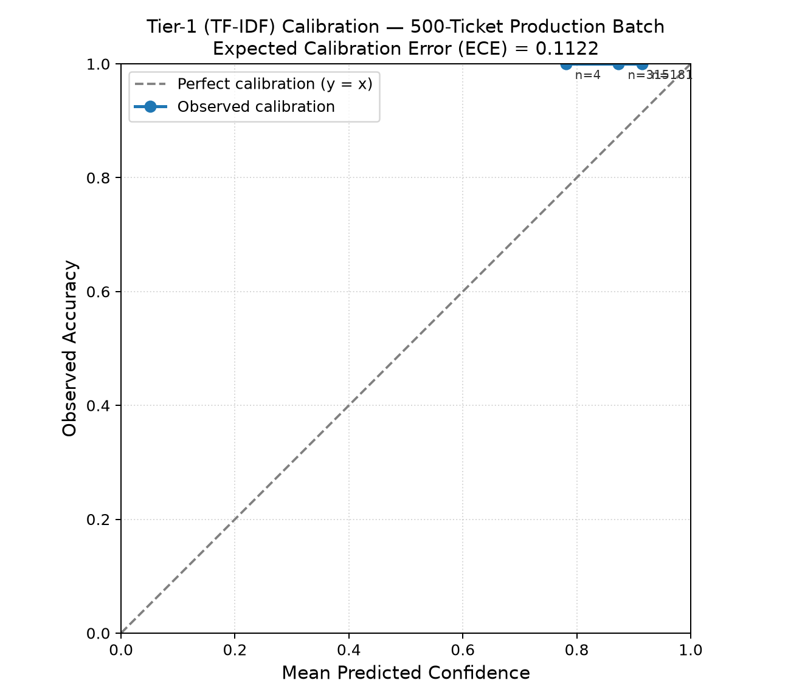
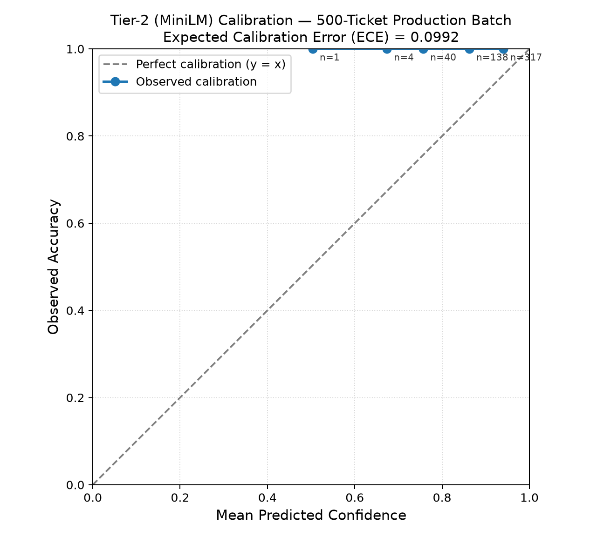

# AI-Powered Intelligent Ticket Routing & Resolution Agent

A three-layer AI system for IT support ticket triage: **classify** the ticket
into the right team, **retrieve** similar past tickets and suggest a grounded
resolution, **flag recurring issues for automation**, and **escalate to a
human** whenever the system isn't confident enough to act on its own. Built
as a B.Tech final-year AI/ML project, based on a nasscom hackathon use-case
brief, with an ongoing extension toward an IEEE-style research paper.

---

## Architecture

1. **Classification Layer** — "which team should this ticket go to?"
   Categories: Infrastructure, Application, Security, Database, Storage,
   Network, Access Management (7 total).
2. **RAG Layer** — "how was this solved before?" Retrieves similar past
   tickets via FAISS and asks Gemini to draft a grounded resolution.
3. **Agentic Layer** — two parts:
   - **Confidence-based escalation** — escalates to a human whenever
     confidence is too low, at two separate decision points
     (classification and retrieval), rather than letting the system guess.
   - **Automation-flagging** — separately, clusters *resolved* tickets by
     resolution similarity to surface recurring issues worth turning into
     self-service automation.

**Tech stack:** Python, scikit-learn, sentence-transformers, FAISS, Gemini
API (`gemini-flash-lite-latest`, via the `google-genai` SDK), Streamlit,
pandas/numpy.

**Repo:** `aryanwaingankar4/ticket-routing-resolution-agent`

---

## The Core Idea

The throughline across this whole project: **every escalation or automation
decision is governed by a calibrated confidence signal, measured against
real data — never assumed.** This shows up independently in three separate
places:

- The RAG layer's similarity threshold (**0.35**) — below this, the LLM
  call is skipped and the ticket goes to a human instead.
- The cascade classifier's confidence threshold (**0.50** at a realistic
  70–80% target-accuracy bar) — below this, classification escalates from
  the cheap TF-IDF model to the stronger MiniLM-embeddings model.
- The resolution-clustering automation-flagging threshold (**0.80**) — a
  calibrated cliff-edge finding, chosen because a false "these two tickets
  share a fix" claim is costlier than a missed automation opportunity.

That consistency — three independent calibration exercises converging on
the same design philosophy — is the actual research contribution, more so
than any single accuracy number.

---

## What Was Built, and What Was Learned

### Dataset

`data/generate_dataset.py` generates synthetic IT support tickets. Each
"scenario" is a linked `(title_template, symptom_phrase, resolution_text)`
tuple so fields stay semantically consistent, and one shared per-ticket
context dict resolves all placeholders (`{app}`, `{srv}`, `{db}`, etc.)
exactly once so entities never disagree across fields. Fixed random seed
(`42`) throughout for reproducibility. The dataset was scaled from an
initial 1,000 tickets to a final **4,000 tickets** (~571–572 per category,
9 scenario templates per category).

### The 14-ticket generalization benchmark

Early on, a TF-IDF + Logistic Regression baseline hit 100% in-distribution
accuracy — a red flag, not a success, on template-generated data prone to
lexical memorization. To get an honest read on real generalization, a
**14-ticket benchmark** was built by hand: 2 tickets per category, written
in plain, non-technical, everyday language that never appears in any
training template. This became the single fixed reference point for the
whole project — defined once in `src/classification/generalization_test.py`
as `NOVEL_TICKETS`, treated as read-only for the entire project, and reused
verbatim everywhere else.

Results against it:

| Method | In-Distribution Accuracy | 14-Ticket Generalization |
|---|---|---|
| TF-IDF + Logistic Regression | 100.0% | 7/14 (50.0%) |
| **Frozen MiniLM embeddings + Logistic Regression** | 100.0% | **10/14 (71.4%) — production choice** |
| Fine-tuned DistilBERT (best epoch) | 100.0% | 7/14 (50.0%) at 1,000 tickets; 7/14 improved to a tie (50.0%, epoch-1 best) after re-testing at 4,000 tickets |

DistilBERT showed a classic overfitting signature at every dataset size
tested — 100% in-distribution accuracy within 1–2 epochs while
generalization plateaued or declined. Re-running the MiniLM benchmark after
scaling the dataset 1,000 → 4,000 tickets produced the *exact same* score
(10/14, same 4 tickets wrong) — proof the ceiling was representation-limited
(the frozen embedding model's own resolution), not data-volume-limited.
**Frozen MiniLM embeddings were selected for production** on measured
generalization performance, not in-distribution accuracy.

### RAG layer (retrieval + Gemini-grounded resolutions)

`build_vector_index.py` builds a FAISS `IndexFlatIP` index over
L2-normalized MiniLM embeddings (cosine similarity via inner product), with
an aligned metadata JSON and a built-in sanity check (querying the index
with a ticket's own embedding must retrieve itself at similarity ~1.0).

`suggest_resolution.py` retrieves the top-5 similar past tickets and, if
the best match clears `SIMILARITY_THRESHOLD = 0.35`, asks Gemini to draft a
resolution grounded in those retrieved tickets. Below that threshold, the
LLM call is skipped entirely and the ticket is escalated to a human. Gemini
never decides the ticket's category — classification is handled entirely
by the trained models above; Gemini's role is strictly resolution
generation.

(Uses the current `google-genai` SDK — `from google import genai` — not the
deprecated `google-generativeai` package, and `gemini-flash-lite-latest`
after the originally-used model was retired for new users.)

### Cascade classifier — confidence-based tier routing

`train_cascade.py` implements a two-tier cascade: Tier-1 (cheap TF-IDF)
resolves a ticket directly if confident enough; otherwise it escalates to
Tier-2 (MiniLM embeddings). This mirrors the RAG layer's "escalate when
unsure" philosophy, applied one layer down at model-selection time.

Calibrating the confidence threshold took three attempts, and the failures
were as informative as the eventual success:

1. **In-distribution held-out split** — rejected. Showed 100% accuracy in
   every confidence bucket, producing a threshold that looked trustworthy
   but missed a confidently-wrong real-world prediction entirely.
2. **35 hand-written calibration tickets** — rejected. Too sparse (34/35
   collapsed into one bucket), so the resulting threshold was driven by
   statistical noise rather than a real signal.
3. **175 Gemini-paraphrased calibration tickets** (25/category, independent
   of the 14-ticket benchmark, with a self-consistency label check — 21/175
   flagged for review, kept anyway since ground truth was preserved) —
   adopted. Dense enough to correctly reveal Tier-1's real overconfidence.

A threshold-derivation logic bug was also caught and fixed along the way:
the scan was breaking on the first small/noisy bucket it failed, before
ever checking better buckets further down.

Final accuracy/efficiency tradeoff, swept across target-reliability bars:

| Target Acc | Threshold | Novel Tier-1 Resolution Rate | Novel Accuracy |
|---:|---:|---:|---:|
| 90% | 1.00 | 0.0% | 71.4% |
| 80% | 0.50 | 21.4% | 71.4% |
| 70% | 0.50 | 21.4% | 71.4% |

At a strict 90% bar, no benefit exists — the cascade collapses to pure
Tier-2. At a relaxed 70–80% bar, a real threshold (0.50) emerges, routing
~21% of real-world tickets through the cheap tier at zero accuracy cost.
The contribution isn't a big accuracy jump — it's a validated calibration
methodology that catches what naive calibration would silently miss.

### Cascade Confidence Calibration

Reliability diagrams (predicted confidence vs. observed accuracy) for both
cascade tiers, evaluated against the real 500-ticket production batch.
Both tiers score 100% accuracy in-distribution but never reach full
confidence (Tier-1 tops out ~0.92, Tier-2 ~0.94) — the models are
**underconfident** rather than overconfident, a safer failure mode for a
system designed around escalation thresholds.

| Tier-1 (TF-IDF) — ECE = 0.1122 | Tier-2 (MiniLM) — ECE = 0.0992 |
|---|---|
|  |  |

Bin-level data: [`calibration_reliability_data.csv`](data/calibration_reliability_data.csv)


### Ablation Study — What the Safety Nets Are Actually Worth

Both cascade and RAG escalation thresholds were disabled independently
to measure their real cost/benefit, rather than assuming they help:

| Mode | 45-Ticket Accuracy | Adversarial Escalation |
|---|---:|---:|
| **Baseline** (both thresholds active) | 68.89% (31/45) | 9/9 correctly escalated |
| **No cascade** (Tier-1 only, threshold=0) | 35.56% (16/45) | — |
| **No RAG gate** (pretend threshold=0) | — | 9/9 would attempt a resolution; 6/9 should have escalated |

**Cascade threshold (0.50):** removing it drops classification accuracy
by 33.3 percentage points on the 45-ticket benchmark — the cascade
isn't a marginal tweak, it roughly doubles real-world classification
accuracy versus running the cheap Tier-1 model alone.

**RAG similarity threshold (0.35):** removing it means every one of the
9 adversarial tickets — including an off-topic weather question and a
pizza recommendation request — would now trigger a real Gemini call
attempting a resolution instead of correctly escalating. 6 of those 9
tickets genuinely needed human escalation, meaning the gate is
preventing 6 concrete instances of confidently-fabricated, wrong output
per this test set alone.

Scripts: `src/experiments/run_ablation_study.py`. Results:
[`ablation_baseline_results.csv`](data/ablation_baseline_results.csv),
[`ablation_no-cascade_results.csv`](data/ablation_no-cascade_results.csv),
[`ablation_no-rag_results.csv`](data/ablation_no-rag_results.csv).


### Streamlit demo

`src/app/streamlit_app.py` ties the cascade classifier and RAG layer into
one clickable demo: predicted category, which tier resolved it and why
(plain-language explanation of the escalation decision), a retrieved
similar-tickets table, and either a Gemini-grounded suggestion or a
visually distinct human-escalation alert.

The demo was verified live, end to end, across every decision path it can
take:

- **Tier-1 (fast path) resolution** — confirmed on direct, keyword-heavy
  tickets (e.g. a storage-quota request resolved at 91.3% Tier-1
  confidence; an account-lockout ticket at 67.8%). Correct category, good
  retrieval, correct suggestion.
- **Tier-2 (escalated) resolution** — confirmed on more conversational
  phrasing (e.g. a VPN timeout ticket, a password-reset ticket, and a
  "reports are timing out" ticket), where Tier-1 confidence fell below the
  0.50 threshold and the ticket correctly escalated to the stronger
  MiniLM-based Tier-2 model, which then classified correctly. In one case,
  Gemini's suggestion correctly flagged that the new ticket didn't specify
  which underlying database was affected, unlike the retrieved examples,
  and recommended a human double-check that detail.
- **RAG-similarity escalation to a human** — confirmed on an intentionally
  unrelated ticket ("what's the weather today"), a vague multi-category
  ticket with no distinctive vocabulary, and a maximally uninformative
  ticket ("something is wrong, please fix it"). In every case, retrieval
  similarity fell below the 0.35 threshold, the Gemini call was correctly
  skipped, and the ticket was escalated to a human instead of a fabricated,
  confident-sounding suggestion. This is a meaningful result on its own: a
  forced-choice classifier can never simply "refuse" to output a category,
  but the retrieval-confidence gate catches exactly this failure mode
  before it reaches an end user.

### Batch-intake simulation (production traffic skew)

Motivated by a mentor question: what happens when real ticket traffic
arrives unevenly across categories? `simulate_ticket_intake.py` draws a
500-ticket batch using a Zipf-style skew, and `process_ticket_batch.py`
runs the full pipeline against it. Result: 100% accuracy, zero escalations
— expected, since the batch is sampled from the same in-distribution
held-out pool the classifier already performs perfectly on. This validated
the *plumbing* (routing, per-category storage, rate-limit handling) under
uneven volume, not classification robustness.

Operationally, this run hit Gemini's free-tier rate limits (15
requests/minute, 500/day) — 15 of 500 resolution calls failed after
retries. Fixed by increasing the per-call delay from 1.5s to 4.5s to stay
under the per-minute cap; the 15 failed calls were later retried
successfully once the daily cap reset.

### Class-imbalance experiment (training-data skew)

The complementary experiment: instead of testing traffic-volume skew
against an already-trained model, this tests what happens when the model
itself is trained on progressively less minority-class data.
`generate_skewed_datasets.py` samples "Access Management" down from its
full 571 tickets to 500 / 200 / 100 / 50, holding the other 6 categories
fixed. Access Management was chosen because it scored perfectly on the
14-ticket benchmark at full data (so any degradation is attributable to
the skew itself) and is semantically adjacent to Security, giving a
plausible, checkable failure mode.

| AM training size | MiniLM 14-ticket benchmark | AM tickets specifically |
|---:|---:|---|
| 571 (baseline) | 11/14 | both correct |
| 500 | 11/14 | both correct |
| 200 | 10/14 | one misclassified → Storage |
| 100 | 9/14 | both wrong → Security, → Storage |
| 50 | 9/14 | both still wrong → Security, → Storage |

Real degradation appears as Access Management shrinks, and one failure
mode is exactly the predicted one (misclassification as Security).
In-distribution accuracy stayed ~99.6–100% at every level, confirming
(again) that in-distribution numbers are uninformative here — only the
14-ticket benchmark exposed the effect. Every wrong Access Management
prediction across all skew levels fell below the 0.50 confidence threshold
and was correctly escalated to a human rather than confidently accepted —
a promising signal, though the sample (1–3 wrong predictions per level) is
small enough that this should be read as directional, not conclusive.

*(Methodology note: this sweep trains and evaluates on an 80% train split,
whereas the cascade's originally-reported 10/14 MiniLM score used a model
retrained on the full dataset — the two numbers aren't directly
comparable; the meaningful result is the degradation trend across skew
levels, not the absolute score at the 571 baseline.)*

### Expanding the benchmark: 14 → 45 tickets

The 14-ticket benchmark is informative but noisy — each ticket is worth
7.1 percentage points. A larger, still-rigorous benchmark was built using
the same Gemini paraphrase-and-verify methodology already proven for the
175-ticket calibration set, but with one deliberate policy difference: for
this benchmark, self-consistency mismatches are **never** auto-kept — they
are flagged for manual human review and excluded by default, since this is
the primary accuracy metric rather than a calibration set.

**Stage 1:** generated 35 candidates (5/category), 32 passed clean, 3 were
flagged and, after manual review, judged genuinely ambiguous boundary
cases — legitimately excluded. Merged with the original 14 = a 46-ticket
benchmark.

**Stage 2 — the Infrastructure bug:** after running the 3-way embedding
comparison against the 46-ticket set, every model got every one of 5
specific "Infrastructure" tickets wrong. Investigation traced the root
cause: those 5 tickets were all physical-facilities issues (flickering
lights, a stuck door, a burst pipe, a broken elevator, a broken heater) —
but this project's actual `Infrastructure` category is tightly and
consistently scoped to compute/server issues (CPU, memory, Kubernetes,
NTP drift, cron jobs, load balancers, disk I/O, autoscaling) with zero
facilities-adjacent scenarios anywhere in the training data. The
generation prompt had only said "plain, non-technical, everyday language"
without anchoring what "Infrastructure" means *for this project*, so
Gemini used the everyday-English sense of the word instead. This was a
benchmark-generation artifact, not a flaw in the dataset's own category
design.

**Fix:** the 5 mislabeled tickets were stripped (46 → 41), 5 replacement
tickets were generated with an explicit scope anchor (positive:
compute/server/K8s/CPU/memory/disk/clock-sync/autoscaling; negative:
explicitly excludes lighting/doors/elevators/plumbing/HVAC), and after
manual review of flagged candidates across two generation attempts, 41 +
2 auto-clean + 2 manually-approved were merged into a final,
fully-trusted **45-ticket benchmark** (`data/novel_tickets_expanded.json`).
A round number (46/49) was deliberately not chased — 45 with full
confidence in every ticket was preferred over a round number with any
doubt.

**Validation that the fix worked:** every model's score improved once the
mislabeled tickets were removed (MiniLM 29/46 → 32/45, BGE 31/46 → 33/45,
E5 27/46 → 27/45). The **BGE-beats-MiniLM finding (73.3% vs 71.1% at
n=45)** is now trustworthy and citable. One genuinely hard case survived
the fix and is worth discussing on its own: a "status page shows green but
the service is actually down" ticket, which all three models still get
wrong — a realistic infrastructure-monitoring ambiguity, not a labeling
error.

### Resolution-clustering calibration

A separate calibration effort, aimed at a different question: can
*resolved* tickets be automatically clustered by their resolution text to
find recurring issues worth flagging for self-service automation?

Resolution text (not the ticket symptom) was embedded with the same
MiniLM model already used elsewhere, then grouped via connected components
at cosine-similarity thresholds swept from 0.99 down to 0.60. Each
threshold's clustering was evaluated with pairwise precision/recall/F1
against real `scenario_id` ground truth (recovered from the dataset
generator's own internal `random.choice()` selection, verified
byte-for-byte reproducible against the pre-change data).

**Finding: a cliff-edge, not a gradual slope.** Precision holds perfectly
(1.0000) all the way down to threshold = 0.80, then collapses sharply at
0.75 and keeps collapsing at looser thresholds. **Threshold = 0.80 was
chosen** — the last point with zero false "these tickets share a fix"
claims — deliberately preferred over the recall-better 0.75, because a
false positive here (wrongly telling ops two different problems share a
fix) is costlier than a false negative (a missed automation opportunity,
which just means the status quo continues). This result was independently
confirmed stable on the complete 500-ticket dataset.

### Automation-flagging feature

The production payoff of the calibration above: `flag_automation_candidates.py`
applies the fixed, calibrated 0.80 threshold to the real resolved-ticket
pipeline output (`data/category_stores/*.csv`) — with no dependency on
ground truth, since production tickets don't have any at run time — and
outputs flagged clusters of tickets that likely share the same underlying
fix, for human review and potential self-service automation.

Run against the full 500-ticket dataset:

| Category | Tickets | Flagged Clusters | Flagged Tickets | Singletons |
|---|---:|---:|---:|---:|
| Infrastructure | 115 | 17 | 107 | 8 |
| Application | 100 | 17 | 84 | 16 |
| Security | 61 | 9 | 56 | 5 |
| Database | 49 | 7 | 24 | 25 |
| Storage | 53 | 10 | 45 | 8 |
| Network | 74 | 14 | 51 | 23 |
| Access Management | 48 | 9 | 29 | 19 |
| **Total** | **500** | **83** | **396** | **104** |

A real, citable pattern emerges in the category-level automation rate:
**Infrastructure's fixes are highly standardized** (93% of tickets fall
into a repeatable cluster — the same handful of runbook-style scenarios
recur constantly), while **Database's fixes are comparatively bespoke**
(49% flagged) — a genuine finding about which categories are naturally
more automatable, not an artifact of the method. Output is written to
`data/automation_candidates.json` (full detail) and
`data/automation_candidates_summary.csv` (one row per flagged cluster, for
citation). As with the confidence-based escalation layer, this flagging is
explicitly designed as a suggestion for human review, not an autonomous
action — the calibration's 1.0000 precision was measured against known
ground truth on the development set, and production tickets carry no such
guarantee at run time.

---

## Final Classification Comparison

| Method | In-Distribution Accuracy | 14-Ticket Generalization | 45-Ticket Generalization |
|---|---|---|---|
| TF-IDF + Logistic Regression | 100.0% | 7/14 (50.0%) | — |
| Frozen MiniLM embeddings + Logistic Regression | 100.0% | 10/14 (71.4%) | 32/45 (71.1%) |
| **Frozen BGE embeddings + Logistic Regression** | — | — | **33/45 (73.3%) — best measured** |
| Frozen E5 embeddings + Logistic Regression | — | — | 27/45 (60.0%) |
| Fine-tuned DistilBERT (best epoch) | 100.0% | 7/14 (50.0%) | — |
| Cascade (TF-IDF → MiniLM, 70–80% target) | — | 10/14 (71.4%), ~21% resolved by cheap tier | — |

MiniLM remains the current production choice (already integrated
throughout the pipeline, including the RAG layer and resolution
clustering); the BGE finding is a validated, citable direction for a
future accuracy-improvement pass rather than a completed swap.

---

## Research / Novelty

Two real academic papers were reviewed to identify a genuine gap:

- **Paper 1** (multi-agent CX architecture) proposed an escalation/
  orchestration design but never implemented or empirically tested it.
- **Paper 2** (IT-ticket classification) rigorously tested classification
  on real enterprise data, but never touched resolution generation, RAG,
  or confidence-based escalation. It did handle real-world class
  imbalance, which directly inspired the class-imbalance experiment above.

**This project's contribution:** an actual end-to-end pipeline covering
classification, retrieval-grounded resolution, confidence-based
escalation, and automation-flagging — empirically measured at every layer,
including honest reporting of calibration methods that *didn't* work and
honest reporting of how the system behaves under both traffic-volume skew
and training-data skew. Confidence-based cascading itself is not novel
(cascade classifiers date to Viola & Jones, 2001; FrugalGPT applies the
same idea to LLM cost) — the honest novelty claim is applying and
rigorously measuring this exact pattern, calibrated against real data
independently at three separate layers, specifically for IT ticket triage.

**Important distinction:** the current system is a *sequential pipeline*
with confidence-based decision points — it is **not** yet a true
multi-agent system (independent agents coordinating via an orchestrator).
That remains a scoped future extension, not something built yet.

---

## What's Done vs. What's Pending

### ✅ Done
- 4,000-ticket dataset with a fixed 14-ticket generalization benchmark
- 3-way classifier comparison (TF-IDF / MiniLM / DistilBERT), re-verified
  at both 1,000 and 4,000 tickets
- Cascade classifier with a fully validated 3-attempt calibration
  methodology and accuracy/efficiency tradeoff analysis
- RAG layer (FAISS retrieval + Gemini-grounded resolution) with a
  similarity-based human-escalation guard
- Working Streamlit demo tying classification + RAG together — verified
  live across all three decision paths (Tier-1 resolution, Tier-2
  escalation, RAG-similarity escalation to a human)
- Batch-intake simulation validating pipeline plumbing under skewed
  production-style traffic volume
- Class-imbalance experiment confirming real accuracy degradation on a
  shrinking minority category, with the escalation mechanism catching
  every resulting error in this run (directional, not conclusive)
- Expanded 45-ticket generalization benchmark, including finding and
  correctly fixing a benchmark-generation labeling bug (not a dataset
  flaw), and a validated BGE > MiniLM finding at the larger sample size
- Resolution-clustering calibration, finding a genuine precision
  cliff-edge and selecting a calibrated threshold (0.80)
- Production automation-flagging feature built and run against the full
  500-ticket dataset, with a citable category-level automation-rate
  finding
- Cascade confidence-calibration reliability diagrams (both tiers),
  evaluated against the real 500-ticket production batch — found both
  tiers to be genuinely underconfident rather than overconfident, a
  safer failure mode for an escalation-gated system
- Literature review identifying a genuine research gap
- Permanent 9-ticket adversarial escalation test set with a live-pipeline
  regression script, finding that escalation is driven solely by RAG
  similarity (not cascade confidence directly) — and that short/generic
  phrasing can still retrieve strongly if it overlaps a dominant
  category's vocabulary, a real dataset-templating limitation worth
  noting rather than a pipeline flaw
- Ablation study quantifying the real measured value of both safety-net
  thresholds: the cascade threshold contributes a 33.3-point accuracy
  gain over Tier-1-only; the RAG gate prevents 6/9 adversarial tickets
  from receiving a fabricated resolution instead of correctly escalating

### ⏳ Pending
3. **Category-specific clustering threshold check** — test whether the
   single 0.80 resolution-clustering threshold is optimal per category,
   or whether e.g. Database (bespoke fixes) needs a different cutoff than
   Infrastructure (highly standardized). Extend
   `calibrate_resolution_clustering.py` to run per-category rather than
   pooled.
4. **BGE swap to production** — now validated as the stronger embedding
   model at n=45 (73.3% vs MiniLM's 71.1%); swap it into
   `train_embeddings.py` / the production classifier and re-verify every
   downstream dependency (RAG layer, resolution clustering, Streamlit
   demo).
5. **Genuine multi-agent restructure** — independent Classification,
   Retrieval, and Resolution agents coordinated by a real Orchestrator,
   likely via n8n (wrapping the existing Python pieces as small local API
   endpoints, then building a real n8n workflow with visual conditional
   routing, e.g. IF confidence < threshold → escalate). Directly closes
   the gap with Paper 1's design, which was proposed but never
   implemented there either. Deliberately done **last**, once everything
   above is measured and stable — it's an architecture/presentation step,
   not a new experiment.
6. **Formal IEEE-style paper draft**, once all of the above is complete.

---

## Project Structure

```
ticket-routing-agent/
├── data/
│   ├── generate_dataset.py
│   ├── synthetic_tickets.csv
│   ├── ticket_embeddings.npy              (gitignored, regenerable cache)
│   ├── ticket_index.faiss
│   ├── ticket_metadata.json
│   ├── calibration_tickets_paraphrased.json
│   ├── novel_tickets_expanded.json        (final 45-ticket benchmark)
│   ├── resolution_clustering_calibration_results.csv
│   ├── exploratory_clustering_results.json
│   ├── automation_candidates.json
│   ├── automation_candidates_summary.csv
│   ├── category_stores_with_scenario_id.csv
│   ├── batch_intake/
│   │   ├── incoming_tickets_batch.csv
│   │   └── batch_summary.csv
│   ├── category_stores/
│   │   ├── {Category}.csv                 (one per category)
│   │   └── escalation_needs_review.csv
│   ├── embedding_comparison/
│   │   └── embedding_model_comparison.csv
│   └── skewed/
│       ├── synthetic_tickets_am{571,500,200,100,50}.csv
│       ├── embeddings_am{571,500,200,100,50}.npy
│       └── imbalance_sweep_results.csv
├── src/
│   ├── classification/
│   │   ├── train_baseline_tfidf.py
│   │   ├── generalization_test.py         (source of truth for NOVEL_TICKETS)
│   │   ├── train_embeddings.py
│   │   ├── train_embeddings_comparison.py
│   │   ├── generalization_test_embeddings.py
│   │   ├── train_distilbert.py
│   │   ├── train_cascade.py
│   │   └── generate_calibration_set.py
│   ├── rag/
│   │   ├── build_vector_index.py
│   │   └── suggest_resolution.py
│   ├── app/
│   │   └── streamlit_app.py
│   └── experiments/
│       ├── simulate_ticket_intake.py
│       ├── process_ticket_batch.py
│       ├── generate_skewed_datasets.py
│       ├── run_imbalance_sweep.py
│       ├── join_scenario_ground_truth.py
│       ├── explore_resolution_clustering.py
│       ├── calibrate_resolution_clustering.py
│       └── flag_automation_candidates.py
├── models/                                 (gitignored, except joblib artifact)
│   ├── ticket_classifier.joblib
│   └── distilbert_ticket_classifier/
├── .env                                    (gitignored — GEMINI_API_KEY)
└── README.md                               (this file)
```

## How to Run

```powershell
# Activate the venv
.\venv\Scripts\Activate.ps1

# 1. Generate the dataset (if not already present)
python data/generate_dataset.py

# 2. Train the production classifier
python src/classification/train_embeddings.py

# 3. Build the RAG index
python src/rag/build_vector_index.py

# 4. Launch the live demo
streamlit run src/app/streamlit_app.py
```

`GEMINI_API_KEY` must be set in a `.env` file at the project root (get a
free key from https://aistudio.google.com/apikey).

### Running the imbalance experiments

```powershell
# Traffic-volume skew (batch simulation)
python src/experiments/simulate_ticket_intake.py
python src/experiments/process_ticket_batch.py

# Training-data skew (the main class-imbalance experiment)
python src/experiments/generate_skewed_datasets.py
python src/experiments/run_imbalance_sweep.py
```

### Running the resolution-clustering / automation-flagging pipeline

```powershell
# (Requires data/category_stores/*.csv to already exist from batch processing)
python src/experiments/join_scenario_ground_truth.py
python src/experiments/explore_resolution_clustering.py
python src/experiments/calibrate_resolution_clustering.py

# The production feature itself (fixed, calibrated threshold=0.80):
python src/experiments/flag_automation_candidates.py
```

---

## Known Open Items

- A couple of stray comment/caption references to a `RESULTS.md` file
  still exist in `streamlit_app.py` (sidebar caption and a code comment)
  from an earlier point in the project when a separate results doc was
  planned. That file was never created — all experimental results now
  live in this README instead. These references should be updated to
  point here the next time that file is touched.

---

## Working Conventions (for future contributors / future me)

- Fixed random seed (`42`) everywhere, for reproducibility.
- Path resolution: project root is always two directories up from a
  script's own location, using `os.path.*` so it works cross-platform.
- Every classification script uses the same 80/20 stratified split
  (`test_size=0.2, random_state=42`) so results are directly comparable.
- The 14-ticket generalization benchmark (`NOVEL_TICKETS`, defined in
  `generalization_test.py`) is never altered — it's one of two fixed
  reference points (alongside the 45-ticket expanded benchmark) used
  across every method comparison in this project.
- Every script fails with clear, actionable error messages instead of raw
  tracebacks — especially important for the Streamlit demo, which may run
  live in front of an audience.
- Embedding caches are always scoped to the exact dataset they were
  computed from (e.g. per skew level) — never reuse a cache keyed to a
  different row count, since that silently misaligns embeddings to the
  wrong tickets.
- Calibrated thresholds (RAG similarity 0.35, cascade confidence 0.50,
  resolution-clustering 0.80) are fixed, evidence-backed constants in
  their respective scripts — never re-derived casually or exposed as
  trivially-overridable CLI flags, since that would undermine the point
  that these values are measured, not guessed.
- Gemini free-tier rate limits: 15 requests/minute, 500 requests/day
  (as of this writing) — keep `GEMINI_CALL_DELAY_SEC` comfortably above
  the per-minute floor (4s) in any batch-calling script.
- Before every commit: run `git status | Select-String "\.npy"` to catch
  any regenerable embedding cache that might have been accidentally
  staged.
